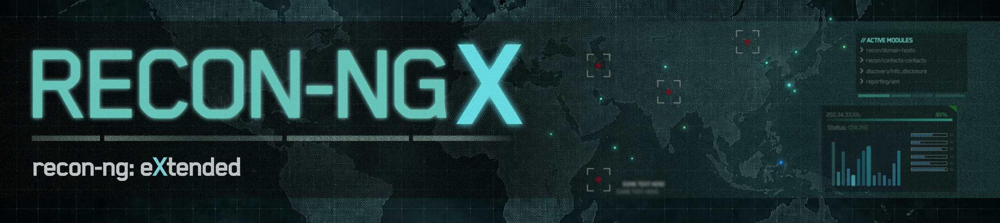

Recon-NGX is a modern rewrite and extension of Tim Tomes’ [**recon-ng**](https://github.com/lanmaster53/recon-ng) OSINT framework.

It is a reimplementation, refactor, and long-term modernisation effort focused on improving 
the architecture, maintainability, and reliability of the original framework, while preserving the 
workflows and flexibility that make recon-ng such a valuable OSINT tool.

> Recon-NGX is recon-ng, **eXtended**.

The core framework has been rebuilt from the ground up using a cleaner architecture
and more modern Python development practices. This has been done by splitting and organising
large areas of functionality into separate packages, modules and classes. Recon-NGX includes
numerous Quality-of-Life fixes, improvements and additions which pave the way for future updates
and expansion.

## :shield: Project Goals
The goal of Recon-NGX is to breathe new life into an essential tool within the OSINT ecosystem by 
making it easier to maintain, extend and modernise.

**Key goals include:**
* Improved maintainability and extensibility
* Cleaner separation of responsibilities between components
* Better long-term developer experience
* Improved reliability and error handling
* Preservation of compatibility with existing modules and workflows, where possible
* Fixes and reliability improvements to existing modules
* Creation of additional modules
* Expansion of the module SDK to enhance module effectiveness and allow for development of more complex modules

## :gear: Features & Improvements
**Current Improvements include:**
* :white_check_mark: Complete rearchitecture of core framework
* :white_check_mark: Decoupling and abstraction of internal systems into separate components
* :white_check_mark: Improved and optimised error handling and messaging
* :white_check_mark: Improved module validation process
* :white_check_mark: Refactoring and expansion of obtuse/minified code to improve readability and maintainability
* :white_check_mark: Expanded and improved code documentation 
* :white_check_mark: Automatic Dependency Installation
* :white_check_mark: Package-based Modules

Additional improvements and architectural changes are ongoing as development continues.

## :round_pushpin: Current Status
Recon-NGX is currently under active development, and should not be considered production-ready
at this stage. While transformation of the main app is now complete, the conversion of Modules for 
compatibility is ongoing.

**Current Areas of Focus:**
* Reviewing and modernising old or unreliable modules

## :alembic: Roadmap & Upcoming Features
* Review, update and QoL improvements for Modules
* Automatic module dependency installation
* Creation of a Graphical User Interface

## :warning: Relationship to recon-ng
While Recon-NGX builds upon the ideas and code of recon-ng, it is an independent 
community-driven project and is not endorsed by, affiliated with, or officially connected to Tim 
Tomes or the original project.

The history and contributions of recon-ng have been preserved to ensure proper credit is given 
to those who contributed to the original project.

recon-ng can be found [Here](https://github.com/lanmaster53/recon-ng)